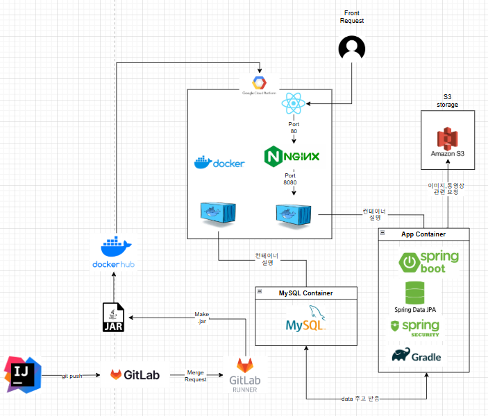

# Aurasphere


> AuraSphere는 사용자들이 일상과 취미를 공유하고, 실시간 알림 및 팔로우 기능으로 활발한 교류를 촉진하는 모바일 기반 SNS 서비스입니다.


## 📖 Description

아우라가 연결되고 개성이 빛나는 곳, AuraSphere는 다양한 사람들이 모여 자신만의 아우라와 개성을 드러내는 소셜 네트워크 서비스(SNS)입니다.
빠르게 변화하는 세상 속에서 여러분만의 아름다움으로 세상을 빛내주세요!


## ⭐ Main Feature
### 1. **다양한 컨텐츠 업로드**
- 사진, 동영상, 텍스트 기반 콘텐츠 업로드

### 2. **인기글 피드 제공**
- 조회수·좋아요 기반 인기 피드 제공

### 3. **팔로우 기능**
- 특정 사용자를 팔로우하여 게시글 구독

### 4. **소통 및 실시간 알림**
- 게시물에 댓글 작성 기능 제공
- 게시글에 좋아요를 눌러 소통
- 알림을 통해 팔로우, 좋아요, 댓글 등의 활동 실시간 전달


## 🔧 Stack
- **Language**: Java 17
- **Framework**: Spring Boot 3.3.7
- **Libraries**:
    - **Lombok**: 1.18.36
    - **MapStruct**: 1.5.2.Final
    - **Spring Security**: 3.3.7
    - **JJWT**: 0.11.5 (JWT 토큰 처리)
    - **Spring Cloud AWS**: 2.2.6.RELEASE
    - **QueryDSL**: 5.0.0 (jakarta)
    - **Springdoc OpenAPI UI**: 2.3.0
    - **Spring Boot DevTools**: 3.3.7 (개발용 도구)
    - **Spring Boot Starter Validation**: 3.3.7
    - **Spring Boot Starter OAuth2 Client**: 3.3.7 (OAuth 2.0 인증)
    - **Spring Boot Starter Mail**: 3.3.7 (이메일 전송)
    - **Dotenv Java**: 3.0.0 (환경 변수 관리)
- **Testing**:
    - **JUnit Platform Launcher**: 1.10.5
- **Database**: MySQL
- **Deploy**:
    - **Containerization**: Docker
    - **CI/CD**: GitLab Runner
    - **Hosting**: GCP VM (엘리스 트랙 제공)


## :open_file_folder: Project Structure

```markdown
src
├─main
│  ├─java
│  │  └─com
│  │      └─elice
│  │          └─aurasphere
│  │              ├─contents
│  │              │  ├─controller
│  │              │  ├─dto
│  │              │  ├─entity
│  │              │  ├─mapper
│  │              │  ├─repository
│  │              │  │  └─repoimpl
│  │              │  └─service
│  │              ├─global
│  │              │  ├─audit
│  │              │  ├─authentication
│  │              │  ├─common
│  │              │  ├─config
│  │              │  ├─exception
│  │              │  │  └─handler
│  │              │  ├─filter
│  │              │  ├─oauth2
│  │              │  ├─s3
│  │              │  │  ├─dto
│  │              │  │  └─service
│  │              │  └─utils
│  │              ├─notification
│  │              │  ├─controller
│  │              │  ├─dto
│  │              │  ├─entity
│  │              │  ├─repository
│  │              │  └─service
│  │              └─user
│  │                  ├─controller
│  │                  ├─dto
│  │                  ├─entity
│  │                  ├─repository
│  │                  └─service
│  └─resources
│      ├─static
│      └─templates
└─test

```

## 🔨 Server Architecture

## ⚒ CI/CD
- GitLab Runner를 활용하여 지속적 통합 및 배포를 자동화함.
- `dev`에서 `master`로 Merge Request를 보내면 CI가 동작하며, Merge가 완료되면 운영 리소스(GCP VM)에 자동 배포됨.

### 🔄 **CI/CD 프로세스**
1. **Prebuild 단계** (`prebuild` 스테이지)
    - `.env` 환경 변수 파일 설정
    - `gradlew` 권한 설정 및 클린 빌드 수행
    - 테스트를 제외한 애플리케이션 빌드 진행
    - 결과물(`.jar` 파일 및 `.env` 파일) 아티팩트 저장

2. **Build 단계** (`build` 스테이지)
    - Docker Hub 로그인
    - Docker 이미지 빌드 및 푸시

3. **Deploy 단계** (`deploy` 스테이지)
    - 기존 컨테이너 종료 및 최신 이미지 Pull
    - 새로운 컨테이너를 실행하여 배포 완료

## 🤝 Collaboration
- **온라인 스크럼 회의**를 통해 주기적으로 진행 상황 공유
- **GitLab 브랜치 전략**을 활용하여 효율적인 협업
- **Figma**를 사용한 UI/UX 기획 및 프로토타이핑

### 💬 **의사소통 및 협업 도구**
- **Peer 리뷰**를 통한 기술적 조언 공유 및 코드 품질 향상
- **기획 아이디어 브레인스토밍**을 통해 기능 확정
- **Discord**: 웹 훅을 활용하여 기능 구현 상태 확인 및 이슈 공유
- **Notion**: 문서화 및 일정 관리

## 👨‍💻 Role & Contribution
### **DevOps**
- CI/CD 구축 (Docker, GitLab Runner)
- 서버 모니터링

### **Etc**
- 개발 일정은 스크럼 회의를 통해 조율하며 각 업무는 `GitLab Issue`를 통해 추적 및 관리하였음.
- 일정은 유동적으로 조정하였음.

## 👨‍👩‍👧‍👦 Developer
*  **김연지** 
*  **백승일** 
*  **안승우**
